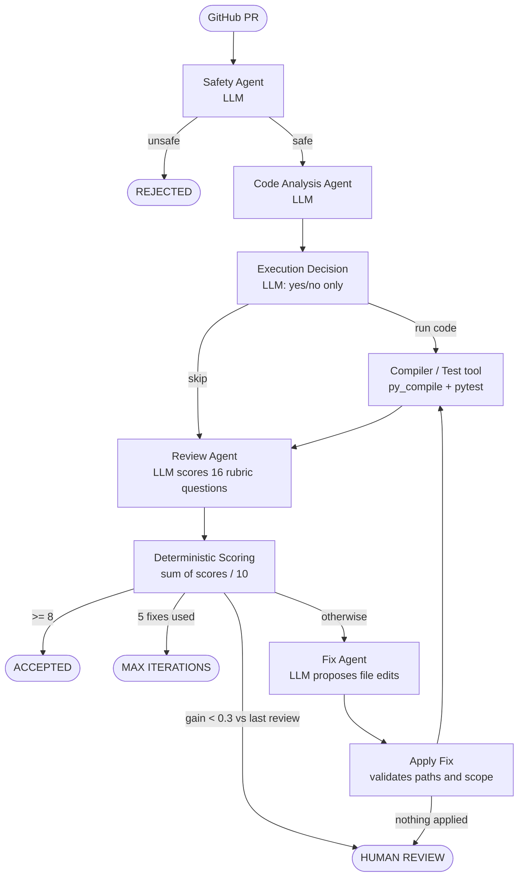

# AI Code Review Agent

Reviews a GitHub pull request with LLM agents, scores it against a fixed rubric **in code**, and
if the score is below the bar, automatically fixes the code, re-tests it and re-reviews it
(up to 5 times).

Built with Python, LangGraph, LangChain (structured outputs), FastAPI and Pydantic.

## How it works



Steps marked **LLM** call the model. Everything else (scoring, routing, applying edits, running
tests) is plain code. The loop is `score → fix → apply fix → compile/test → review → score`.

**Stop conditions**, checked in this order after every review:

| Condition | Result |
|---|---|
| score ≥ 8.0 | `accepted` |
| score improved by less than `MIN_SCORE_IMPROVEMENT` (0.3) since the previous review, or got worse | `human_review` |
| 5 fix attempts already made | `max_iterations` |
| otherwise | fix and try again |

The safety agent can also end a run early with `rejected_unsafe`.

### Scoring

The review LLM answers 16 fixed questions, each with an integer score up to that question's
maximum, and **never computes a total**. Code validates that every question is answered exactly
once and in range, then `final_score = sum(all scores) / 10`.

| Category | Points | Questions |
|---|---|---|
| Correctness | 30 | C1 intent (10), C2 edge cases (8), C3 error handling (6), C4 no regressions (6) |
| Code Quality | 20 | Q1 readability (7), Q2 structure (7), Q3 idioms (6) |
| Security | 20 | S1 input validation (8), S2 secrets/auth (6), S3 unsafe APIs (6) |
| Testing & Validation | 15 | T1 tests added (6), T2 edge-case tests (5), T3 execution results (4) |
| Maintainability | 15 | M1 modularity (6), M2 docs (4), M3 complexity (5) |

### What the tools do

- **GitHub** (`app/github.py`, read-only): PR title, description, diff, changed files, plus the
  repository's Python and test-config files at the PR head (one tarball download).
- **Compiler/test tool** (`app/runner.py`): runs `py_compile` on changed `.py` files and then
  `pytest` if the repo has tests. The commands are fixed in code; the LLM never supplies a
  command, and no shell is used. Each step has a timeout and a scrubbed environment (no API
  keys).
- **Fix Agent** (`app/agents/fix.py`): gets the code, PR requirement, review comments, failed
  rubric questions, compiler output, test output and previous score. It returns whole-file
  edits. **Apply Fix** (`app/fixes.py`) only accepts edits to files the PR already changed, or
  test files.

## Security: read this before enabling pytest

`py_compile` only parses code. **`pytest` executes the PR's code on your machine**, with no real
sandbox. For that reason it is **off by default** (`ENABLE_TEST_EXECUTION=false`). Only enable it
for repositories you trust, or run the whole service in a container or VM. The safety agent is
an LLM check and is not a security boundary.

PR content is passed to the models as delimited, explicitly untrusted data, but prompt injection
is not fully solved by that.

## Setup

```bash
python -m venv .venv
.venv\Scripts\activate          # Windows;  source .venv/bin/activate on macOS/Linux
pip install -r requirements.txt
cp .env.example .env            # then set ANTHROPIC_API_KEY (and GITHUB_TOKEN for private repos)
```

## Run it

**Tests** (no API key needed; the LLM is faked):

```bash
python -m pytest -q
```

**Demo** (no API key needed): intentionally buggy Python goes through the full fix loop, using a
scripted stand-in for the LLM and the real compiler, pytest and scoring:

```bash
python -m demo.buggy_demo
```

**CLI** against a real PR (needs `GROQ_API_KEY`):

```bash
python -m app.cli owner/repo#123
```

**API:**

```bash
python -m uvicorn app.main:app --port 8000
```

```bash
curl -X POST http://localhost:8000/review \
  -H "Content-Type: application/json" \
  -d '{"pr": "owner/repo#123"}'
```

`pr` can also be a URL such as `https://github.com/owner/repo/pull/123`.
Errors: `422` bad PR reference, `502` GitHub error, `503` missing API key.

### Example terminal log

From `python -m demo.buggy_demo` (trimmed). Set `LOG_LEVEL=DEBUG` for more detail.

```
10:00:04 INFO  -> compile_test
10:00:05 INFO    compile/test: FAILED
   | py_compile: FAILED
   | File "stats.py", line 4
   |     def mean(values)
   |                     ^
   | SyntaxError: expected ':'
10:00:05 INFO  -> scoring
10:00:05 INFO    score 4.5/10  history=[4.5]  {'Correctness': 15, ...}
10:00:05 INFO    decision: fix
10:00:05 INFO  -> fix
10:00:05 INFO    fixer proposes 1 edit(s): Add the missing colon after mean(values).
10:00:05 INFO  -> apply_fix
10:00:05 INFO    fix round 1: applied=['stats.py'] rejected={}
   ...
10:00:05 INFO    fix round 2: applied=['stats.py'] rejected={'setup.py': 'not a file changed by this PR or a test file'}
10:00:05 INFO    compile/test: PASSED
10:00:05 INFO    score 9.0/10  history=[4.5, 6.9, 9.0]  {...}
10:00:05 INFO    decision: accepted
10:00:05 INFO    FINAL STATUS: accepted
```

### Example API response

Produced by the demo (scripted LLM, stubbed GitHub), so the scores are illustrative; a real run
has the same shape.

```json
{
  "pr": "demo/stats#1",
  "status": "accepted",
  "score": 9.0,
  "score_history": [4.5, 6.9, 9.0],
  "category_totals": {
    "Correctness": 30, "Code Quality": 19, "Security": 17,
    "Testing & Validation": 12, "Maintainability": 12
  },
  "iterations": 2,
  "safety_reasons": [],
  "execution": "py_compile: OK (2 files)\npytest: OK\n....  [100%]\n4 passed in 0.02s",
  "comments": [],
  "fix_log": [
    {"round": 1, "summary": "Add the missing colon after mean(values).",
     "applied": ["stats.py"], "rejected": {}, "score_before": 4.5},
    {"round": 2, "summary": "Raise ValueError on empty input; average the middle two for even-length median.",
     "applied": ["stats.py"],
     "rejected": {"setup.py": "not a file changed by this PR or a test file"},
     "score_before": 6.9}
  ]
}
```

`status` is one of `accepted`, `human_review`, `max_iterations`, `rejected_unsafe`.

## Configuration

All settings live in `.env` (see `.env.example`, which documents each one).

## Project layout

```
app/
  main.py        FastAPI app and review_pr()
  cli.py         python -m app.cli owner/repo#123
  workflow.py    LangGraph graph (nodes + edges)
  state.py       graph state and Pydantic models
  rubric.py      the 16 rubric questions, validation, score math
  scoring.py     scoring and stop/continue decision
  nodes.py       non-LLM nodes: compile/test, scoring, apply fix, routing
  agents/        safety, analysis, execution decision, review, fix (LLM)
  github.py      GitHub client
  runner.py      py_compile / pytest runner
  fixes.py       validates and applies fix edits
  llm.py         the one place a chat model is created
  config.py, log.py
demo/buggy_demo.py   end-to-end demo with buggy code
tests/               44 tests, no network or API key needed
```

## Limitations

- Only Python is validated (`py_compile`, `pytest`). Other languages are reviewed but not run.
- Dependencies of the reviewed repository are not installed, so PRs that need third-party
  packages can fail pytest with import errors.
- Fixes are not pushed to GitHub or returned by the API; they live only in the workflow state.
- The fix agent cannot edit unchanged non-test files, even if the bug is there.
- Nothing stops the fix agent from weakening a test other than its prompt.
- The real LLM prompts have not been exercised against a live model in development; the tests
  and demo use scripted fakes.
